# **Problem Set 1**
## **COURSE: **TIP7200 - DIGITAL SIGNAL PROCESSING
## INSTRUCTOR: ANDRE LIMA FERRER ALMEIDA
## ID NUMBER: 544957
### PROBLEM 1 - Implement in MATLAB (or a similar programming tool) the moving average system with the parameters $M_1$ and $M_2$:
\matlabheadingthree
$$
y[n]=\frac{1}{M_1 +M_2 +1}\sum_{k=-M_1 }^{M_2 } x[n-k]
$$
### Next, use your function to filter an audio signal (soon to be available). Analyze $M_1$ and $M_2$ values' effect on the output signal. Such analysis can be done by listening to the output audio signal and comparing it to the original one. Try it for different value combinations. Plot a snippet of the audio signal before and after the filtering process to the different case studies.   


First, the moving average function is implemented as it follows:


**function** y = mov_avg(M1,M2,i,a,x)


k = 1/(M1+M2+1);


y = k*sum(x(i-(M2+M1+1)+a:i-1+a));


**end**


Due to to the computational process limitations and to simplify the problem $M_1$ will assume the valur 0 for all case studies. Thus, $M_2$ will be equals to 100 for the first case:


```matlab:Code
clc; clear all; close all;

M1 = 0;
M2 = 100;
```


However, y[0] is actually y[1] because the former index doesn't exist in practice. Due to the circunstances, the variables need to be incremented by 1 unit:


```matlab:Code
a = 1;
```


The first analyzed audio signal is "cantinaband.wav". To import the data to workspace and listen to the audio signal using the computer speakers (at the sample rate of 8192 Hz), the following command are executed respectively:


```matlab:Code
[x,Fs] = audioread("cantinaband.wav");
sound(x);
```


The plot of the orignal data can be seen below:


```matlab:Code
t = 0:seconds(1/Fs):seconds(length(x)/Fs);
t = t(1:end-1);

fig = figure; clf

plot(t,x); hold on
grid on
plotlatex(fig,'Audio Data', 'Time', 'Audio Signal');
hold off
```


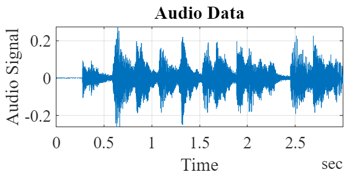


where,$x[n]$is the is the original audio signal and $F_s$ is the sample rate and its value corresponds to 22050 Hz. Now, the signal is filtered using the MA function implemented:


```matlab:Code
y = [];
for i=M2+1:1:length(x)
    y(i+a) = mov_avg(M1,M2,i,a,x);
end
y = y(1:end-a); % (*)
```


**NOTE:** As it is seen the y[n] length is smaller than the one who originates it. So, the information present on the y[1], ..., y[M2] are unuseful information and to give coherence to the problem presented, the y[1], ..., y[M2] are discarded:


```matlab:Code
y = y(M1+M2+1:end); % (**)
```


**NOTE 2:** It is possible to calculate one more output data position outside the length of the original time series. However, is it correct to do it theoretically?


....


Combining the logic applied into the operations (*) and (**), an alternative way to reshape y[n] is:


 **y = y(M1+M2+1:end-a);**


The filtered signal has the following behavior now:


```matlab:Code
tn = seconds((M1+M2+1)/Fs):seconds(1/Fs):seconds(length(x)/Fs);

fig = figure; clf

plot(tn,y); hold on
grid on
plotlatex(fig,['Filtered Data (M1 = ',num2str(M1),', M2 = ',num2str(M2),')'],'Time', 'Audio Signal');
hold off
```


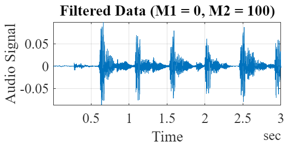


```matlab:Code

sound(y);
audiowrite("cantfit100.wav",y,Fs);
```


**QUESTION: IF THE OUTPUT DATA LENGTH IS SMALLER THAN THE INPUT ONE, IN TERMS OF POSITION/TIME y[n] INITIAL POSITION IS N = M2+1, RIGHT?**


Assuming now $M_2$ equals to 1000 and using the MA function, the filtered data have the behavior plotted below:


```matlab:Code
M1 = 0;
M2 = 1000;

y = [];
for i=M2+1:1:length(x)
    y(i+a) = mov_avg(M1,M2,i,a,x);
end
y = y(M1+M2+1:end-a);

tn = seconds((M1+M2+1)/Fs):seconds(1/Fs):seconds(length(x)/Fs);

fig = figure; clf

plot(tn,y); hold on
grid on
plotlatex(fig,['Filtered Data (M1 = ',num2str(M1),', M2 = ',num2str(M2),')'],'Time', 'Audio Signal');
hold off
```


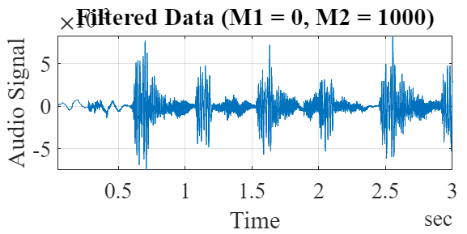


```matlab:Code

sound(y);
audiowrite("cantfit1000.wav",y,Fs);
```


Changing $M_2$ value to 10000 (e.g. provoking an windowing augmenting) and applying the MA function once more, the filtering signal has the has the response plotted bellow:


```matlab:Code
M1 = 0;
M2 = 10000;

y = [];
for i=M2+1:1:length(x)
    y(i+a) = mov_avg(M1,M2,i,a,x);
end
y = y(M1+M2+1:end-a);

tn = seconds((M1+M2+1)/Fs):seconds(1/Fs):seconds(length(x)/Fs);

fig = figure; clf

plot(tn,y); hold on
grid on
plotlatex(fig,['Filtered Data (M1 = ',num2str(M1),', M2 = ',num2str(M2),')'],'Time', 'Audio Signal');
hold off
```


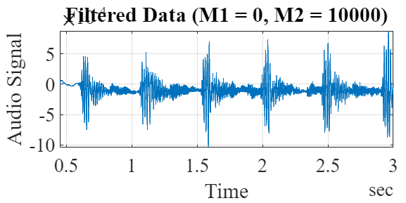


```matlab:Code

sound(y);
audiowrite("cantfit10000.wav",y,Fs);
```


Doing the same procedures on the audio signal "fala_sino.wav", it has the behaviors that are plotted bellow:


```matlab:Code
[x,Fs] = audioread("fala_sino.wav");
sound(x);

t = 0:seconds(1/Fs):seconds(length(x)/Fs);
t = t(1:end-1);

fig = figure; clf

plot(t,x); hold on
grid on
plotlatex(fig,'Audio Data', 'Time', 'Audio Signal');
hold off
```


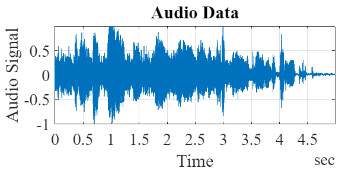


```matlab:Code

M1 = 0;
M2 = 100;

y = [];
for i=M2+1:1:length(x)
    y(i+a) = mov_avg(M1,M2,i,a,x);
end
y = y(M1+M2+1:end-a);

tn = seconds((M1+M2+1)/Fs):seconds(1/Fs):seconds(length(x)/Fs);

fig = figure; clf

plot(tn,y); hold on
grid on
plotlatex(fig,['Filtered Data (M1 = ',num2str(M1),', M2 = ',num2str(M2),')'],'Time', 'Audio Signal');
hold off
```


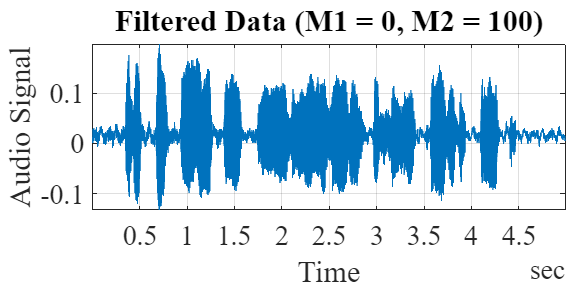


```matlab:Code

sound(y);
audiowrite("falafit100.wav",y,Fs);

M1 = 0;
M2 = 1000;

y = [];
for i=M2+1:1:length(x)
    y(i+a) = mov_avg(M1,M2,i,a,x);
end
y = y(M1+M2+1:end-a);

tn = seconds((M1+M2+1)/Fs):seconds(1/Fs):seconds(length(x)/Fs);

fig = figure; clf

plot(tn,y); hold on
grid on
plotlatex(fig,['Filtered Data (M1 = ',num2str(M1),', M2 = ',num2str(M2),')'],'Time', 'Audio Signal');
hold off
```


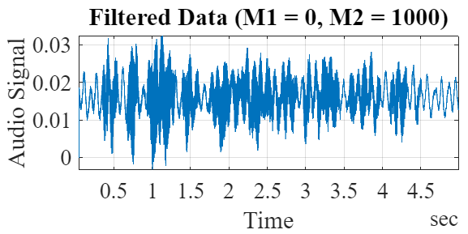


```matlab:Code

sound(y);
audiowrite("falafit1000.wav",y,Fs);

M1 = 0;
M2 = 10000;

y = [];
for i=M2+1:1:length(x)
    y(i+a) = mov_avg(M1,M2,i,a,x);
end
y = y(M1+M2+1:end-a);

tn = seconds((M1+M2+1)/Fs):seconds(1/Fs):seconds(length(x)/Fs);

fig = figure; clf

plot(tn,y); hold on
grid on
plotlatex(fig,['Filtered Data (M1 = ',num2str(M1),', M2 = ',num2str(M2),')'],'Time', 'Audio Signal');
hold off
```


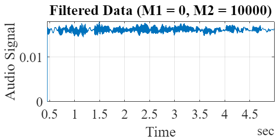


```matlab:Code

sound(y);
audiowrite("falafit10000.wav",y,Fs);
```


In face of all the case studies from above is possible to conclude that if the windowing length increase, then the better is the noise and/or high frequency filtering.


### PROBLEM 2 - Apply the backward difference that is defined by the relation $y[n]=x[n]-x[n-1]$. Next, use your function to filter the same audio signals from the PROBLEM 1. Evaluate the filtering effect on the output signal. Plot a snippet of the audio signal before and after the filtering process.    


First, the backward difference function is implemented as it follows:


**function** y = b_diff(i,x)


y = x(i)-x(i-1);


**end**


To load the audio data into workspace the previous commands from the PROBLEM 1 are used again. Thus, "cantinaband.wav" is the first analyzed signal: 


```matlab:Code
[x1,Fs1] = audioread("cantinaband.wav");
sound(x1);

t1 = 0:seconds(1/Fs1):seconds(length(x1)/Fs1);
t1 = t1(1:end-1);

fig = figure; clf

plot(t1,x1); hold on
grid on
plotlatex(fig,'Audio Data', 'Time', 'Audio Signal');
hold off
```


It is not possible to work with negative indexes. Thus, the initial position must be fixed in 0. However,  MATLAB also doesn't allow work with the 0 index (same problem presented on PROBLEM 1) and the data is moved by 1 unit which means:


```matlab:Code
a = 1;
```


Now, the filtering process using backward difference is applied on the audio data:


```matlab:Code
y1 = [];
for i=1+a:1:length(x1)
    y1(i) = b_diff(i,x1);
end
y1 = y1(a+1:end);
```


The output signal resulted from the filtering process is plotted bellow:


```matlab:Code
tn1 = seconds((a+1)/Fs1):seconds(1/Fs1):seconds(length(x1)/Fs1);

fig = figure; clf

plot(tn1,y1); hold on
grid on
plotlatex(fig,['Filtered Data (Backward Difference)'],'Time', 'Audio Signal');
hold off
```


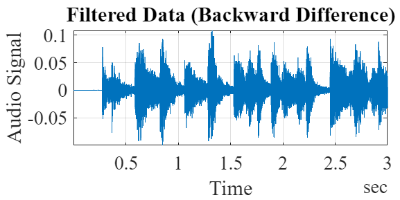


```matlab:Code

sound(y1);
audiowrite("cantfitdiff.wav",y1,Fs1);
```


Doing the same steps above to "fala_sino.wav", the output response has the following behavior compared to the original data:


```matlab:Code
[x1,Fs1] = audioread("fala_sino.wav");
sound(x1);

t1 = 0:seconds(1/Fs1):seconds(length(x1)/Fs1);
t1 = t1(1:end-1);

fig = figure; clf

plot(t1,x1); hold on
grid on
plotlatex(fig,'Audio Data', 'Time', 'Audio Signal');
hold off
```


```matlab:Code

y1 = [];
for i=1+a:1:length(x1)
    y1(i) = b_diff(i,x1);
end
y1 = y1(a+1:end);

tn1 = seconds((a+1)/Fs1):seconds(1/Fs1):seconds(length(x1)/Fs1);

fig = figure; clf

plot(tn1,y1); hold on
grid on
plotlatex(fig,['Filtered Data (Backward Difference)'],'Time', 'Audio Signal');
hold off
```


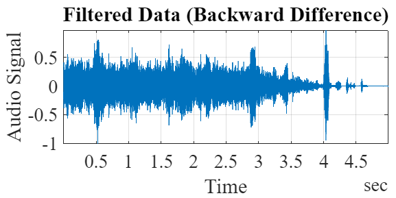


```matlab:Code

sound(y1);
audiowrite("cantfitdiff.wav",y1,Fs1);
```


```text:Output
Warning: Data clipped when writing file.
```


It is possible to note that the signal autocorrelation of both signals are lower because their response to the filtering process would be smoother otherwise.


### **PROBLEM 3 - Implement a function that operates the convolution sum considering any **$x[n]$** input and **$h[n]$** LTI system. Now, consider the LTI system denoted by its impulse response**
\matlabheadingthree
$$
h[n]=\delta [n]+\frac{1}{2}\delta [n-1]-\frac{1}{4}\delta [n-3]
$$
### **Using your function and considering the audio signal used on the previous problems, obtain the system output response. Evaluate the results. **


The convolution sum is defined as


> $y[n]=\sum_{k=-\infty }^{\infty } x[k]h[n-k],$         for all $n$.


Implenting the operation on MATLAB:


**function** y = conv_sum(N,Nh,x,h,y)


**for** i=1:1:N-Nh


    x_aux = x(i)*h;


    j=1;


    **while** j<=Nh


        y(i+j) = y(i+j)+x_aux(j);


        j=j+1;


    **end**


**end**


**end**


The LTI system denoted by its impulse response can be implemented as it follows:


```matlab:Code
h = [0.25 0 0.5 1];
```


Note that it is impossible to exist an negative index in a computational implementation and to solve the case it is assumed that $h[1]=\frac{1}{4}\delta [n-3],h[2]=0,h[3]=\frac{1}{2}\delta [n-1]$ and $h[4]=\delta [n]$. 


Next, to load the audio data into workspace the previous commands from the PROBLEM 1 and 2 are used again. Thus, "cantinaband.wav" is the first analyzed signal:


```matlab:Code
[x2,Fs2] = audioread("cantinaband.wav");
sound(x2);

t2 = 0:seconds(1/Fs2):seconds(length(x2)/Fs2);
t2 = t2(1:end-1);

fig = figure; clf

plot(t2,x2); hold on
grid on
plotlatex(fig,'Audio Data', 'Time', 'Audio Signal');
hold off
```


Now, the convolution sum is calculated using the previous implemention proposed and its response is plotted bellow:


```matlab:Code
Nh = length(h);
N = length(x2);
y2 = x2-x2;

y2 = conv_sum(N,Nh,x2,h,y2);

fig = figure; clf

stem(y2, '-r','LineWidth',0.5); hold on
grid on
plotlatex(fig, 'Convolution Sum', 'n', 'y[n]');
hold off
```


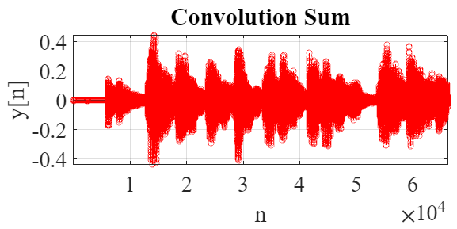


To verify if the operation was done correctly, it was used the MATLAB function conv() and the signal resulted from the operation is plotted bellow:


```matlab:Code
test = conv(x2,h);

fig = figure; clf

stem(test, '-b','LineWidth',0.5); hold on
grid on
plotlatex(fig, 'conv()', 'n', 'y[n]');
hold off
```


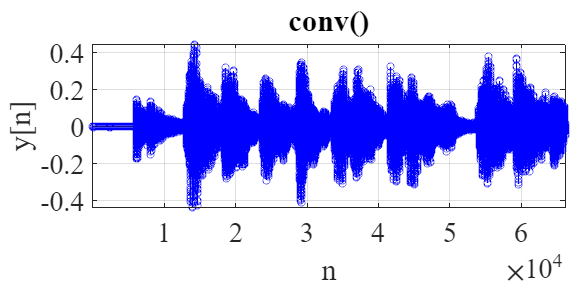


It is easy to note that the responses are very similiar and then it is possible to conclude that the implemention was correctly done. It is also important to note that the system in question apparently didn't change the frequency of the input signal. However, the output singal has a higher magnitude compared to the input one.


Now, doing the same steps above to "fala_sino.wav", the output response has the following behavior compared to the original data:  


```matlab:Code
[x2,Fs2] = audioread("fala_sino.wav");
sound(x2);

t2 = 0:seconds(1/Fs2):seconds(length(x2)/Fs2);
t2 = t2(1:end-1);

fig = figure; clf

plot(t2,x2); hold on
grid on
plotlatex(fig,'Audio Data', 'Time', 'Audio Signal');
hold off
```


```matlab:Code

Nh = length(h);
N = length(x2);
y2 = x2-x2;

y2 = conv_sum(N,Nh,x2,h,y2);

fig = figure; clf

stem(y2, '-r','LineWidth',0.5); hold on
grid on
plotlatex(fig, 'Convolution Sum', 'n', 'y[n]');
hold off
```


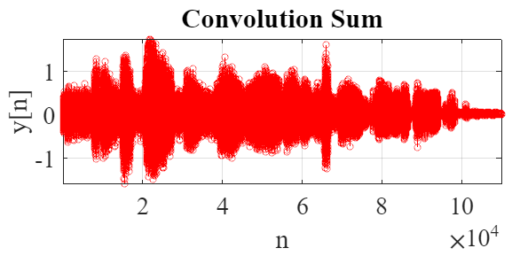


```matlab:Code

test = conv(x2,h);

fig = figure; clf

stem(test, '-b','LineWidth',0.5); hold on
grid on
plotlatex(fig, 'conv()', 'n', 'y[n]');
hold off
```


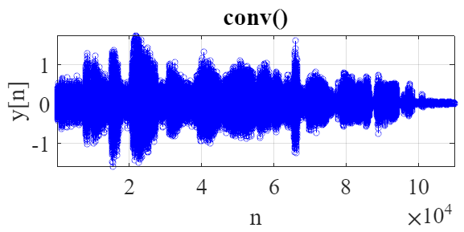


As it was expected, both responses are very similiar and it is possible to conclude that the convolution sum implemented is correct. And as it was also expected the system in question didn't change the frequency of the input signal. However, the output signal has a higher magnitude compared to the input one.


