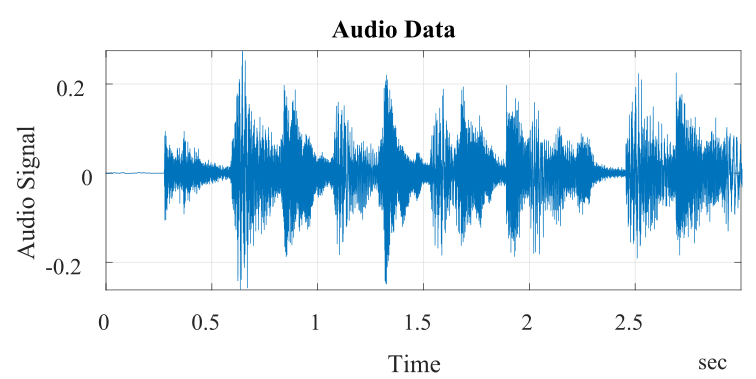
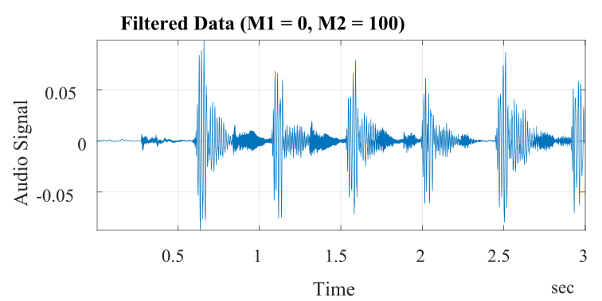

# Digital Signal Processing

> This repository is a comprehensive archive of assignments undertaken for the *Digital Signal Processing* course (TIP7200) at the Federal University of Ceará as part of my Master's curriculum.

## Introduction 📖

Signal processing is essential in understanding and manipulating the information contained within signals. It encompasses the representation, transformation, and manipulation of these signals. Discrete-time signal processing focuses on the analysis of numeric sequences indexed by integers, a cornerstone of Digital Signal Processing (DSP). In DSP, signals are digitally represented by sequences of finite-precision numbers, allowing for processing via digital computation. The advent of faster computing has made real-time discrete-time processing of continuous-time signals a reality across various fields. Today, DSP is integral to advancements in communication systems, radar and sonar technologies, speech and video processing, biomedical engineering, and countless other application areas, highlighting its critical role in modern technology and innovation.

## Assignments Description 🗃️

> [!NOTE]
> The main codes are in the files with a `.mlx` extension.

### [Assignment 1](ProblemSet1): Discrete-Time Signals and Systems
- **Description:** This assignment consists of the implementation and analysis of the Moving Average (MA), Backward Difference, and Convolution Sum.

### [Assignment 2](ProblemSet2): Fourier Transform
- **Description:** This assignment involves the use of the Fourier transform to analyze various situations involving the system's response to a certain input and its effect on the original characteristics of the input signal. The design of an equalizer to

## License 📄

This project is licensed under the MIT License - see the [LICENSE.md](LICENSE.md) file for details.

## Contact 📬

If you have any questions or suggestions about the project, please feel free to reach out:

- **LinkedIn**: [My LinkedIn Profile](https://www.linkedin.com/in/andreza-nascimento-ce/)
- **Email**: `andrezacosta@alu.ufc.br`
